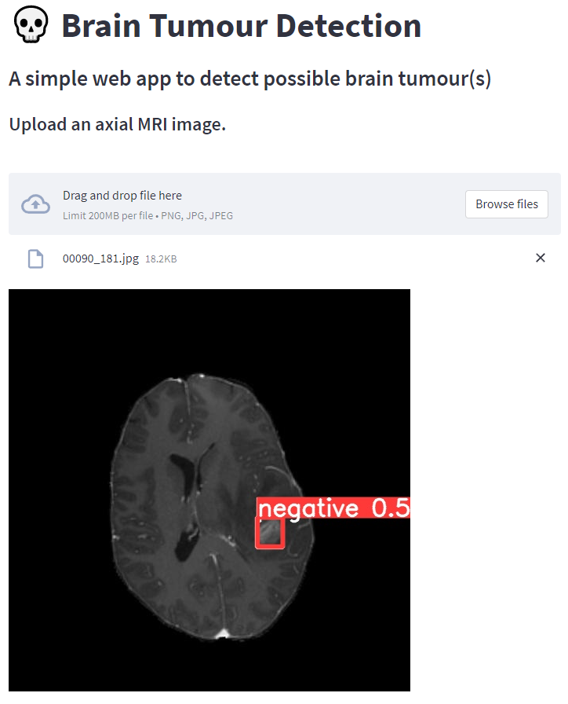

# Brain Tumour Detection
This basic web app is able to detect and identify brain tumor(s) in an MRI scan.

[YoloV5](https://github.com/ultralytics/yolov5) was used to train the default model and labelling the images was done using [MakeSense](https://www.makesense.ai/). The  [Brain Tumor Object Detection Datasets](https://www.kaggle.com/datasets/davidbroberts/brain-tumor-object-detection-datasets) was used for training and testing.

## Setup Guide
Few steps to follow before getting started.

1. Download the **YoloV5** github repository
2. Create a directory called `runs` with the following subdirectories `train\weights`
3. Move `best.py`  to the newly created directly (this contains the weights of the trained model)

## Training Results
The table records the results of training with different weights and epochs. The constant parameters include:
- *batch size=16* 
- *image size=640*

|      | Epochs   | Weights | mAP@.5   | mAP@.5:.95   |
|------|:--------:|---------|:--------:|:------------:|
| exp2 | 30       | YoloV5s | 0.914    | 0.651        |
| exp3 | 60       | YoloV5s | 0.923    | 0.651        |
| exp4 | 30       | YoloV5m | 0.917    | 0.602        |
| exp5 | 60       | YoloV5m |          |              |
| exp6 | 30       | YoloV5l | 0.852    | 0.606        |
| exp7 | 60       | YoloV5l |          |              |

Based on the table, **exp3** recorded the highest mAP@.5 and used in the web app. The files are included in this repository.

## Notes
- [ ] Deploy model to cloud (GCP)
- [ ] Modify Colab notebook